```{r initialize, echo = FALSE}
knitr::opts_chunk$set(
  collapse = TRUE,
  comment = "#>"
)
```

```{r setup, include = FALSE}
### needed libraries
library(cmocean)
library(mapdata)
library(plotdap)
library(rerddap)
library(rerddapXtracto)

```

## Introduction

`rerddapXtracto` is an [R]{style="color:red"} package developed to subset and extract satellite and other oceanographic related data from any [ERDDAP™]{style="color:red"} server using the [R]{style="color:red"} package [rerddap](https://cran.r-project.org/package=rerddap) developed by Scott Chamberlain and the wonderful people at 'rOpenSci'. [ERDDAP™]{style="color:red"} is a simple to use yet powerful web data service developed by Bob Simons. `rerddapXtracto` extends the `rerddap` package by allowing a user to extract data for a moving point in time along a user-supplied set of longitude, latitude, depth and time points; and also extracting data within a polygon (through time).

`rerddapXtracto` version 1.0.0 represented a major rewrite of the internal workings of `rxtracto()`, which were invisible to the user but provided for faster execution particularly for large tracks. Among other improvements. instead of doing an extract for each point, one extract is done for all points that match to the same time period in the ERDDAP dataset. For large extracts,this can make a very large difference in the speed of execution. This also means that for extracts that do not have a time coordinate, such as bathymetric data, only one extract will be made from ERDDAP™. If the data are of high enough resolution and the data request covers a large enough area, it is possible this will exceed the 2GB limit of ERDDAP™ netCDF files, and the extract will have to be done in pieces.

`rerddapXtracto` version 1.1.0 and above now allow `rxtracto()` to use the new "interpolate" service in [ERDDAP™]{style="color:red"}. The "interpolate" service allows for 100 points along the track to be processed at a time, which can greatly speed-up large extracts. A downside is that "neighbors" are done in terms of pixels, not coordinate units, so that for high-resolution datasets the "neighborhood" used to make the interpolation can be quite small in terms of coordinate units. Presently the dataset must have at least coordinates of time, latitude and longitude, so that the interpolate feature will not work with 2-D datasets such as bathymetry data.

Features that have been added over the course of development include allowing the z-coordinate to vary in both `rxtracto()` and `rxtracto_3D()`; plotting functions `plotTrack()` and `plotBBox()` that can take the output from `rxtracto()` and `rxtracto_3D()`and produce maps of the data, including animated maps; the ability to cross the dateline in a request when the ERDDAP™ dataset has longitudes in the range (-180, 180); an optional progress bar in `rxtracto()`; and the return in `rxtracto()` of values extracted so far should the extract fail partway through the extract; `rxtracto()` ow works with projected datasets and an example is given below .

Since the z-coordinate is not limited to be at a set location, for `rxtracto_3D()` this means that if the z-coordinate needs to be given, then it must be of length two. For `rxtracto()` if the z-coordinate needs to be given it must be of the same length as the other coordinates, and can also have a "zlen"", like"xlen" and "ylen", that defines a bounding box within which to make the extract. The advantage of this is it allows `rxtracto()` to make extracts moving in (x, y, z, t) space.

The plotting function `plotTrack()` for tracks and `plotBBox()` for grids use the [R]{style="color:red"} package `plotdap`, originally developed for producing maps from data extracted using `rerddap`. The plotting functions now allow for user defined continental outlines (important if crossing the dateline), a user defined crs, as well as animation. When more control of a plot is desired, `ggplot2` (or other map plotting packages) can be used directly. Several examples in this vignette demonstrate the use of `ggplot2`.

Requesting an extract that crosses the dateline for an ERDDAP™ dataset that is on a (-180, 180) longitude grid must be done with care. The requested longitudes must be in the range (0, 360) and several checks that the request is within the bounds of the dataset are disabled. This is particularly important when using `rxtracto()`, where the observed longitude point may not cross the dateline but the bounding box defined by "xlen" may cross it.

### The Main `rerddapXtracto` functions

There are three main data extraction functions in the `rerddapXtracto` package:

-   `rxtracto <- function(dataInfo, parameter = NULL, xcoord = NULL, ycoord = NULL, zcoord = NULL, tcoord = NULL, xlen = 0., ylen = 0., zlen = 0., xName = 'longitude', yName = 'latitude', zName = 'altitude', tName = 'time', interp = NULL, verbose = FALSE,  progress_bar = FALSE)`

-   `rxtracto_3D <- function(dataInfo, parameter = NULL, xcoord = NULL, ycoord = NULL, zcoord = NULL, tcoord = NULL, xName = 'longitude', yName = 'latitude', zName = 'altitude', tName = 'time', verbose = FALSE, cache_remove = TRUE)`

-   `rxtractogon <- function(dataInfo, parameter, xcoord = NULL, ycoord = NULL, zcoord = NULL, tcoord = NULL, xName = 'longitude', yName = 'latitude', zName = 'altitude', tName = 'time', verbose = FALSE)`

and two functions for producing maps:

-   `plotTrack <- function(resp, xcoord, ycoord, tcoord, plotColor = 'viridis', myFunc = NA, mapData = NULL, crs = NULL, animate = FALSE, cumulative = FALSE, name = NA,  shape = 20, size = .5)`

-   `plotBBox <- function(resp, plotColor = 'viridis', time = NA, myFunc = NA, mapData = NULL, crs = NULL, animate = FALSE, cumulative = FALSE, name = NA, maxpixels = 10000)`

New since version 1.1.6 is a helper function to convert output from `rxtracto_3D()` and `rxtractogon()` to "tidy" long-form:

-   `tidy_grid <- function(response)`

This makes it easier to use the output in packages such as `ggplot2`.

The data extraction functions require information about the dataset obtained by the function `rerddap::info()`, and possibly having to give the names of the coordinate variables, as these can not be assumed (for example the zcoord could be in sigma coordinates). More specifically:

-   dataInfo: the return from an `rerddap::info()` call to a dataset on an [ERDDAP™]{style="color:red"} server
-   parameter: character string containing the name of the parameter to extract
-   xName: character string with name of the xcoord in the [ERDDAP™]{style="color:red"} dataset (default "longitude")
-   yName: character string with name of the ycoord in the [ERDDAP™]{style="color:red"} dataset (default "latitude")
-   zName: character string with name of the zcoord in the [ERDDAP™]{style="color:red"} dataset (default "altitude")
-   tName: character string with name of the tcoord in the [ERDDAP™]{style="color:red"} dataset (default "time")
-   verbose: logical variable (default FALSE) if the the URL request should be verbose

### Time has come today

With all due respect to the 'Chambers Brothers (their song 'Time Has Come Today'), since any [ERDDAP™]{style="color:red"} served gridded data can be accessed, care must be used with the values of "time" passed to `rerddapXtracto`. Datasets can have time increments of less than a day, an example of which is [given below](#hourly). [ERDDAP]{style="color:red"} maps all times to "Zulu" time, of the form "2016-11-01T00:00:00Z". The date-time "2016-11-01" gets mapped to "2016-11-01T00:00:00Z". Some [R]{style="color:red"} date-time functions when the resolution is finer than a day map the time to the time-zone of the user's computer. Be certain that the times you give will be mapped correctly. The `parse_date()` function of the [parsedate](https://cran.r-project.org/package=parsedate) package is used to translate date-time strings, if in doubt you can use that function to see how the times you are passing will be interpreted.

## Setting up

`rerddapXtracto` uses the [R]{style="color:red"} packages `ncdf4`, `parsedate`, `plotdap`, `rerddap`, and `sp`, and these packages (and the packages imported by these packages) must be installed first or `rerddapXtracto` will fail to install.

```{r install, eval = FALSE}
install.packages("ncdf4", dependencies = TRUE) 
install.packages("parsedate", dependencies = TRUE)
install.packages("plotdap", dependencies = TRUE)
install.packages("rerddap", dependencies = TRUE)
install.packages("sp", dependencies = TRUE)
```

The `rerddapXtracto` package is available through [CRAN]{style="color:blue"} and can be installed by:

```{r install_package, eval = FALSE}
install.packages("rerddapXtracto", dependencies = TRUE)
```

The development version of the `rerddapXtracto` package is available from [Github](https://github.com/rmendels/rerddapXtracto). To install the development version,

```{r installGit, eval = FALSE}
install.packages("devtools")
remotes::install_github("rmendels/rerddapXtracto", subdir = 'development')
```

Note that `plotdap` depends on a number of packages that must be installed. These include the packages `cmocean`, `ggplot2`, `raster` and `sf`. To use the animation features, `gganimate` must be installed.

If the other [R]{style="color:red"} libraries have been installed they will be found and do not need to be explicitly loaded.

### Using the R code examples

Once installed, to use `rerddapXtracto`:

```{r, eval = FALSE}
library("rerddapXtracto")
```

and to use the plotting functions:

```{r, eval = FALSE}
library("gganimate")
library("ggplot2")
library("plotdap")
```

## Getting Started

There are some fine points that need to be understood to properly use the plotting functions, in particular `plotBBox()`. Both `plotTrack()` and `plotBBox()` rearrange the output so that the functions `plotdap::add_tabledap()` and `plotdap::add_griddap()` think that the output is from `rerddap`, and then make the appropriate `plotdap` call. When the data that are passed to `add_griddap()` has multiple time periods, there are two options. The first option is to set the parameter "time" to a function that reduces the data to one dimension in the time coordinate (such as the mean), or else to set "time" equal to "identity" and set "animate" to be "TRUE" which will produce a time animation of the results. If an animation is requested and the option "cumulative" is set to be "TRUE", then the animation will be cumulative. This is a nice feature for displaying tracks through time. The function `plotBBox()` works the same way, except that the default function is `mean(na.rm = TRUE)`. The following link to examples that show how to use different features of the plotting functions:

-   [Setting the color palette](#colorPalette) shows how to use the "plotColor" option. The "plotColor" parameter can be the name of any of the colors included in the `cmocean` package. The `cmocean` colormaps were designed by Kristen Thyng (see <https://matplotlib.org/cmocean/> and <https://github.com/matplotlib/cmocean>), and were initially developed for Python)

-   [Plot one time period](#plot1) example shows how to manipulate an existing output from `rxtracto_3D()` or `rextractogon()` to plot just one time period.

-   [Transform the data](#transform) example shows how to use the "myFunc" option to transform the data before plotting. The function has to be a function of a single argument. This example also shows how to use the "name" option to change the name displayed on the color bar. In this example, we want depth to go downwards in the colorbar, and the name given changed from "altitude", which is the name on [ERDDAP]{style="color:red"}, to the name "Depth".

-   [Name](#name) example shows how to change the name on the colorbar.

-   [Modify the graph](#modify) shows how to use the `plotdap` function `add_ggplot()` to modify a graph once it has been generated.

-   [Animate a track](#animateTrack) shows how to animate a track over time.

-   [Animate a grid](#animateGrid) shows how to animate a grid with multiple time periods.

The first step is to obtain information about the dataset of interest from the [ERDDAP™]{style="color:red"} server being used. The needed information include:

-   baseURL of the [ERDDAP™]{style="color:red"} server (the default is <https://upwell.pfeg.noaa.gov/erddap>)
-   the datasetID of the data to be accessed (for example the 1-day composite of chlorophyll from MODIS Aqua has a datasetID of 'erdMBchla1day' - see <https://upwell.pfeg.noaa.gov/erddap/griddap/erdMBchla1day.html>)
-   the parameter name (in this case "chlorophyll")

In order for `rerddapXtracto` to have this information, as well as the coordinate variables and their limits, and the parameter names, a call must be made to the function `rerddap::info()` for the appropriate datasetID and baseURL:

```{r info, echo = TRUE, eval = FALSE}
require("rerddap")
## base URL does not need to given because it is the default one
dataInfo <- info('erdMBchla1day')
dataInfo
```

this returns the following information:

```{r dataInfo, echo = TRUE, eval = FALSE}
<ERDDAP™ info> erdMBchla1day 
 Base URL: https://upwell.pfeg.noaa.gov/erddap/ 
 Dimensions (range):  
     time: (2006-01-01T12:00:00Z, 2020-10-27T12:00:00Z) 
     altitude: (0.0, 0.0) 
     latitude: (-45.0, 65.0) 
     longitude: (120.0, 320.0) 
 Variables:  
     chlorophyll: 
         Units: mg m-3

```

##  Using `rxtracto` 

### Marlin tag track

In this section data is extracted along a trackline found in the [Marlintag38606]{style="color:red"} dataset, which is the track of a tagged marlin in the Pacific Ocean (courtesy of Dr. Mike Musyl of the Pelagic Research Group LLC), and then simple plots of the extracted data are made. Since this can be a long extract, a progress bar is displayed:

```{r getMarlinChl, eval = FALSE, echo = TRUE}
require("rerddap")
require("rerddapXtracto")

# First we will copy the Marlintag38606 data into a variable 
# called tagData  so that subsequent code will be more generic.  

tagData <- Marlintag38606
xpos <- tagData$lon
ypos <- tagData$lat
tpos <- tagData$date
zpos <- rep(0., length(xpos))
swchlInfo <- rerddap::info('erdSWchla8day')
swchl1 <- rxtracto(swchlInfo, parameter = 'chlorophyll', 
                   xcoord = xpos, ycoord = ypos, tcoord = tpos, zcoord = zpos, 
                   xlen = .2, ylen = .2, progress_bar = TRUE)
```

### Plotting the results

The track line with the locations colored according to the mean of the satellite `chlorophyll` around that point can be plotted using `plotTrack()`. Positions where there was a tag location but no `chlorophyll` values are also shown. This example shows the use of the "plotColor" parameter to use the `cmocean` "algae" color palette.

```{r meantrackPlot, eval = FALSE, echo = TRUE}
require("ggplot2")
require("plotdap")

myPlot <- plotTrack(swchl1, xpos, ypos, tpos, plotColor = 'algae')
myPlot
```

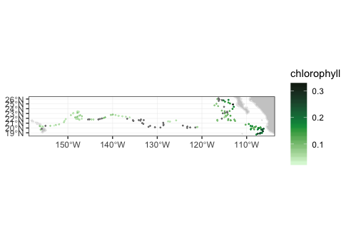

### Animating the track

To make a cumulative animation of the track:

```{r animateTrack, echo = TRUE, eval = FALSE}
myPlot <- plotTrack(swchl1, xpos, ypos, tpos, plotColor = 'algae',
                    animate = TRUE, cumulative = TRUE)

```

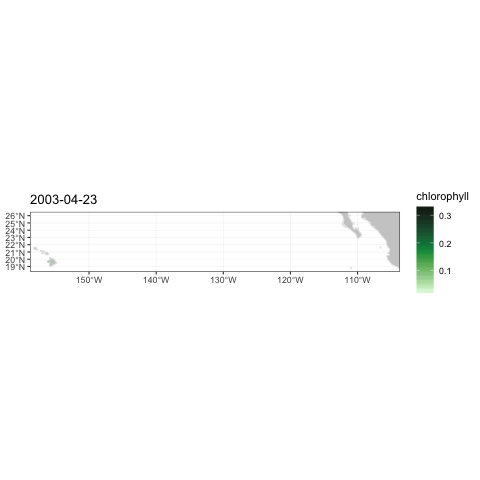

Output from `rxtracto()` can readily be converted to a form for use in the "tidyverse" by converting the output to a dataframe, to wit:

```{r tidy_track, echo = TRUE, eval = FALSE}

swchl1_tidy <- as.data.frame(swchl1)

```

### Topography data

This example demonstrates how to pass a function to `plotTrack()` to transform the data before plotting, how to change the name shown on the colorbar, and how to call `plotTrack()` if the dataset does not have a time coordinate.

```{r topotag, eval = FALSE, echo = TRUE}
require("ggplot2")
require("plotdap")
require("rerddap")
require("rerddapXtracto")
ylim <- c(15, 30)
xlim <- c(-160, -105)
topoInfo <- rerddap::info('etopo360')
topo <- rxtracto(topoInfo, parameter = 'altitude', xcoord = xpos, ycoord = ypos, xlen = .1, ylen = .1)
myFunc = function(x) -x
topoPlot <- plotTrack(topo, xpos, ypos, NA, plotColor = 'dense', 
                      name = 'Depth', myFunc = myFunc)
topoPlot
```

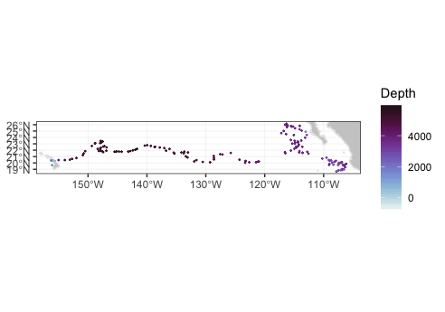

### Track moving in (x, y, z, t) space.

The following is an artificial example showing a track moving in (x, y, z, t) space. Since the times of the model output change, the actual times are retrieved, and the last three times used in the example.

```{r extract3D, echo = TRUE, eval = FALSE}
require("rerddap")
urlBase <- "https://erddap.marine.ie/erddap/"
parameter <- "Sea_water_temperature"
dataInfo <- rerddap::info("IMI_CONN_3D", url = urlBase)
#get the actual last 3 times,  and extract from data frame
dataInfo1 <- read.csv("https://erddap.marine.ie/erddap/griddap/IMI_CONN_3D.csv0?time[last-2:1:last]", stringsAsFactors = FALSE, header = FALSE, row.names = NULL)
sstTimes <- dataInfo1[[1]]
sstLats <- c(53.505758092414446, 53.509303546859805, 53.51284900130517)
sstLons <- c(-10.25975390624996, -10.247847656249961, -10.23594140624996)
sstDepths <- c(2, 6, 10)
sstTrack <- rxtracto(dataInfo, parameter = parameter, xcoord = sstLons, ycoord = sstLats, tcoord = sstTimes, zcoord = sstDepths, xlen = .05, ylen = .05, zlen = 0., zName = 'altitude')
str(sstTrack)
```

This returns the following structure information:

```{r extract3D_struct, echo = TRUE, eval = FALSE}
List of 13
 $ mean Sea_water_temperature  : num [1:3] 11.7 11.7 11.6
 $ stdev Sea_water_temperature : num [1:3] 0.0407 0.0555 0.0859
 $ n                           : int [1:3] 493 491 484
 $ satellite date              : chr [1:3] "2020-10-31T22:00:00Z" "2020-10-31T23:00:00Z" "2020-11-01T00:00:00Z"
 $ requested lon min           : num [1:3] -10.3 -10.3 -10.3
 $ requested lon max           : num [1:3] -10.2 -10.2 -10.2
 $ requested lat min           : num [1:3] 53.5 53.5 53.5
 $ requested lat max           : num [1:3] 53.5 53.5 53.5
 $ requested z min             : num [1:3] 2 6 10
 $ requested z max             : num [1:3] 2 6 10
 $ requested date              : chr [1:3] "2020-10-31T22:00:00Z" "2020-10-31T23:00:00Z" "2020-11-01T00:00:00Z"
 $ median Sea_water_temperature: num [1:3] 11.7 11.7 11.6
 $ mad Sea_water_temperature   : num [1:3] 0.0208 0.0361 0.0986
 - attr(*, "row.names")= chr [1:3] "1" "2" "3"
 - attr(*, "class")= chr [1:2] "list" "rxtractoTrack"

```

### Crossing the dateline

The following is an artificial example of a track that crosses the date-line, using the MUR(Multi-scale Ultra-high Resolution) SST analysis:

```{r dateline_track, echo = TRUE,  eval = FALSE}
dataInfo <- rerddap::info('jplMURSST41mday')
parameter <- 'sst'
xcoord <- c(179.7, 179.8, 179.9, 180., 180.1, 180.2, 180.3, 180.4)
ycoord <- c(40, 40, 40, 40, 40, 40, 40, 40)
tcoord <- c('2018-03-16', '2018-03-16', '2018-03-16','2018-03-16','2018-03-16',
            '2018-03-16','2018-03-16','2018-03-16')
xlen <- .05
ylen <- .05
extract <- rxtracto(dataInfo, parameter = parameter, xcoord = xcoord,
                    ycoord = ycoord, tcoord = tcoord,
                    xlen = xlen, ylen = ylen)
str(extract)
```

The returned structure is:

```{r dateline_track_struct, echo = TRUE,  eval = FALSE}
List of 13
 $ mean sst         : num [1:8] 11.1 11.1 11.1 11.2 11.1 ...
 $ stdev sst        : num [1:8] 0.01192 0.00602 0.01025 0.00876 0.01446 ...
 $ n                : int [1:8] 30 30 35 25 30 30 30 35
 $ satellite date   : chr [1:8] "2018-03-16T00:00:00Z" "2018-03-16T00:00:00Z" "2018-03-16T00:00:00Z" "2018-03-16T00:00:00Z" ...
 $ requested lon min: num [1:8] 180 180 180 180 180 ...
 $ requested lon max: num [1:8] 180 180 180 180 180 ...
 $ requested lat min: num [1:8] 40 40 40 40 40 ...
 $ requested lat max: num [1:8] 40 40 40 40 40 ...
 $ requested z min  : logi [1:8] NA NA NA NA NA NA ...
 $ requested z max  : logi [1:8] NA NA NA NA NA NA ...
 $ requested date   : chr [1:8] "2018-03-16" "2018-03-16" "2018-03-16" "2018-03-16" ...
 $ median sst       : num [1:8] 11.1 11.1 11.1 11.2 11.1 ...
 $ mad sst          : num [1:8] 0.01416 0.0052 0.01149 0.00887 0.01744 ...
 - attr(*, "row.names")= chr [1:8] "1" "2" "3" "4" ...
 - attr(*, "class")= chr [1:2] "list" "rxtractoTrack"

```

### [ERDDAP™]{style="color:red"} Interpolate service

[ERDDAP™]{style="color:red"} has a new "Interpolate" service which takes a table of coordinate values from a gridded dataset, up to 100 entries at a time, and will interpolate the value at each point based on quite a large list of different interpolation methods, as well as the number of neighbors to use in the interpolation (see <https://coastwatch.pfeg.noaa.gov/erddap/convert/interpolate.html>. As the "Interpolate" service includes the mean, median and standard deviation of the neighboring points, the service can return similar results as does the usual `rxtracto()` but much more quickly, as 100 observations are processed at a time. This greatly reduces the time it takes to process very large tracks. A downside is that neighbors are defined in terms of pixels, not in terms of coordinate units as is used in the usual `rxtracto()` call. For very high-resolution datasets even the largest number of neighbors provided by the service may not be large enough to capture the uncertainty in the actual location of an observation in the track.

The "Interpolate" service requires that the [ERDDAP™]{style="color:red"} server being accessed is at least version 2.10. As of this writing, the default [ERDDAP™]{style="color:red"} in `rerddap` is at <https://upwell.pfeg.noaa.gov/erddap>, which is not. Therefore, as in the example below, you need to make certain of the version of [ERDDAP™]{style="color:red"} used in the call to `rerddap:info()`.

The "interpolate" option is implemented in a new, optional argument to `rxtracto()`, "interp = NULL". Since the argument is optional, and has a default value of "NULL", existing calls to `rxtracto()` will not be affected by the change. To use the interpolation option, "interp" must be a set equal to a character array of size 2, that is

```{r, echo = TRUE,  eval = FALSE}
interp <- c('interpolation method', 'number of neighbors')
```

For example, to use the 'Mean' function with 16 neighbors this would be:

```{r, echo = TRUE,  eval = FALSE}
interp <- c('Mean',  '16')
```

Note carefully that "Mean" is capitalized, and that the number of neighbors is passed as a character string, not as a number. Also the values of "xlen", "ylen", and "zlen", if given, are ignored. So to use the "interp" option in the first Marlin example, the call would be:

```{r, echo = TRUE,  eval = FALSE}
my_interp <- c('Mean',  '16')
#
#  use the coastwatch ERDDAP™ as it is a more recent version
#
swchlInfo <- rerddap::info('erdSWchla8day', 
             url = 'https://coastwatch.pfeg.noaa.gov/erddap/')
swchl1 <- rxtracto(swchlInfo, parameter = 'chlorophyll', 
                   xcoord = xpos, ycoord = ypos, tcoord = tpos, zcoord = zpos,
                   interp = my_interp, progress_bar = TRUE)

```

### Tracks along projected data and Polar Bears

`rxtracto()` can now extract tracks from projected [ERDDAP™]{style="color:red"} datasets if the proper data transformations are done first. Here we cover one possible way of transforming the data in order to work with `rxtracto()` by extracting sea ice concentration along a polar bear track. The polar bear track is in the included 'PB_Argos' dataset, which is described in the paper "Auger-Méthé, M., Newman, K., Cole, D., Empacher, F., Gryba, R., King, A. A., Leos-Barajas, V., Mills Flemming, J., Nielsen, A., Petris, G., and Thomas, L.. 2021. A guide to state--space modeling of ecological time series. Ecological Monographs 91(4):e01470. 10.1002/ecm.1470" and is used by permission of the authors. The dataset was obtained from <https://datadryad.org/dataset/doi:10.5061/dryad.4qrfj6q96>.

One caveat is that while the vector parameters "xlen", "ylen" and "zlen" can still be used with projected data, to be sensible these values must also be in projected units, and for many projections in order to have a consistent box the values will have to vary with each latitude-longitude pair. With the present version of `rxtracto()` it is up to the user to make this calculation, though the steps below should provide some idea of how to do so. In the example, "xlen", "ylen" are zero.

Given a "track" with latitude and longitude values and a projected dataset, the following steps are necessary:

-   Determine the projection used in the [ERDDAP™]{style="color:red"} dataset.

-   Transform the latitudes and longitudes into this projection.

-   Make the extract

-   If desired, transform the projected coordinates back into latitude and longitude.

The dataset to be used is sea ice concentration from the NOAA/National Snow and Ice Data Center availabe from the Polarwatch [ERDDAP]{style="color:red"} at <https://polarwatch.noaa.gov/erddap/griddap/nsidcG02202v4nh1day.html> .

The first step is to extract the first 100 datapoints from the PB_Argos dataset.

```{r, echo = TRUE,  eval = FALSE}
PB_Argos_subset <- PB_Argos[1:100, ]
# datetime is not in format for ERDDAP™
PB_Argos_subset$DateTime <- lubridate::as_datetime(PB_Argos_subset$DateTime)
head(PB_Argos_subset, 4)

# A tibble: 4 × 4
  DateTime            QualClass   Lat   Lon
  <dttm>              <chr>     <dbl> <dbl>
1 2009-04-20 17:01:39 B          70.4 -132.
2 2009-04-20 17:23:00 A          71.0 -131.
3 2009-04-20 18:12:15 A          71.0 -131.
4 2009-04-20 20:43:17 A          70.9 -131.

```

The dataset info can be used to find the dataset projection (note this uses EPSG codes for the CRS, which can be found at <https://spatialreference.org/ref/epsg/>):

```{r, echo = TRUE,  eval = FALSE}
url=  'https://polarwatch.noaa.gov/erddap/'
datasetid = 'nsidcG02202v4nh1day'
dataInfo <- rerddap::info(datasetid, url)
proj_crs_code_index <- which(dataInfo$alldata$NC_GLOBAL$attribute_name == "proj_crs_code" )
proj_crs_code <- dataInfo$alldata$NC_GLOBAL$value[proj_crs_code_index]
proj_crs_code
[1] "EPSG:3411"
```

Next we will create a temporary dataframe with the latitude and longitude values, convert that dataframe to an 'sf' object, and then transform the coordinates:

```{r, echo = TRUE,  eval = FALSE}
temp_df <- data.frame(Lat = PB_Argos_subset$Lat, Lon = PB_Argos_subset$Lon)
# transform PB_Argos_subset to sf object
# EPSG:4326 is basic lat-lon coordinates
temp_df <- sf::st_as_sf(temp_df, coords = c("Lon", "Lat"), crs = 4326)
# project data 
temp_df <- sf::st_transform(temp_df, crs = 3411)
# get projection coordinates
coordinates <- sf::st_coordinates(temp_df)
```

Now things are set to perform the extract:

```{r, echo = TRUE,  eval = FALSE}
xcoord <- coordinates[, 1]
ycoord <- coordinates[, 2]
# R datetimes are passed as number,  require ISO character string
tcoord <- as.character(PB_Argos_subset$DateTime)
parameter <- 'cdr_seaice_conc'
extract <- rxtracto(dataInfo,
                    xName="xgrid",
                    yName="ygrid",
                    tName="time",
                    parameter=parameter,
                    xcoord = xcoord,
                    ycoord = ycoord,
                    tcoord = tcoord
                    )
str(extract)
List of 13
 $ mean cdr_seaice_conc  : num [1:100] 1 1 1 1 1 1 1 1 1 1 ...
 $ stdev cdr_seaice_conc : num [1:100] NA NA NA NA NA NA NA NA NA NA ...
 $ n                     : int [1:100] 1 1 1 1 1 1 1 1 1 1 ...
 $ satellite date        : chr [1:100] "2009-04-21T00:00:00Z" "2009-04-21T00:00:00Z" "2009-04-21T00:00:00Z" "2009-04-21T00:00:00Z" ...
 $ requested x min       : num [1:100] -2143958 -2077605 -2077124 -2082576 -2036149 ...
 $ requested x max       : num [1:100] -2143958 -2077605 -2077124 -2082576 -2036149 ...
 $ requested y min       : num [1:100] -118477 -131404 -131955 -130368 -120720 ...
 $ requested y max       : num [1:100] -118477 -131404 -131955 -130368 -120720 ...
 $ requested z min       : logi [1:100] NA NA NA NA NA NA ...
 $ requested z max       : logi [1:100] NA NA NA NA NA NA ...
 $ requested date        : chr [1:100] "2009-04-20 17:01:39" "2009-04-20 17:23:00" "2009-04-20 18:12:15" "2009-04-20 20:43:17" ...
 $ median cdr_seaice_conc: num [1:100] 1 1 1 1 1 1 1 1 1 1 ...
 $ mad cdr_seaice_conc   : num [1:100] 0 0 0 0 0 0 0 0 0 0 ...
 - attr(*, "row.names")= chr [1:100] "1" "2" "3" "4" ...
 - attr(*, "class")= chr [1:2] "list" "rxtractoTrack"

```
Since a given location may not fall on a gridpoint of the dataset and extracts are performed at the nearest grid point, the locations of the extract in terms of latitude and longitude can be obtained by reversing the steps above:

```{r, echo = TRUE,  eval = FALSE}
xgrid <- 'requested x min'
ygrid <- 'requested y min'
temp_df <- data.frame(xgrid = extract[[xgrid]], ygrid = extract[[ygrid]])
temp_df <- sf::st_as_sf(temp_df, coords = c("xgrid", "ygrid"), crs = 3411)
temp_df <- sf::st_transform(temp_df, crs = 4326)
coordinates <- sf::st_coordinates(temp_df)

```


## Using `rxtracto_3D`

The function `rxtracto_3D()` adds no new capabilities to `rerddap`, but returns the data as an array, rather than "melted" as does `rerddap::griddap()`. `rxtracto_3D()` also is used in the function `rxtractogon()`, so is provided for consistency. `rxtracto_3D()` also changes latitudes and longitudes to agree with those of the source [ERDDAP™]{style="color:red"} dataset, and returns a structure where these are mapped back to the request.

### Obtaining VIIRS chlorophyll data

We examine VIIRS chlorophyll for the "latest" data as of when the vignette was generated:

```{r VIIRSchla, echo = TRUE, eval = FALSE}
require("rerddap")
require("rerddapXtracto")

xpos <- c(-125, -120) 
ypos <- c(39, 36)
tpos <- c("last", "last")
tpos <- c("2017-04-15", "2017-04-15")
VIIRSInfo <- rerddap::info('erdVH3chlamday')
VIIRS <- rxtracto_3D(VIIRSInfo, parameter = 'chla', xcoord = xpos, ycoord = ypos, tcoord = tpos)
```

`rxtracto_3d()` returns a list of the form:

-   VIIRS\$chla : num [xcoord, ycoord, tcoord]
-   VIIRS\$datasetname: character string of the ERDDAP™ dataset ID
-   VIIRS\$longitude : num [xcoord] longitude of extract
-   VIIRS\$latitude : num [ycoord] latitudes of extract
-   VIIRS\$altitude : num zcoord of extract
-   VIIRS\$time : POSIXlt[tcoord] times of extract

The coordinate names of the structure are based on the names given in the `rxtracto_3d()` call, so may differ between datasets.

The extracted data can be mapped using `plotBBox()`:

```{r VIIRSLogPlot, echo = TRUE, eval = FALSE}
require("ggplot2")
require("plotdap")
myFunc <- function(x) log(x)
chlalogPlot <- plotBBox(VIIRS, plotColor = 'algae', myFunc = myFunc)
chlalogPlot
```

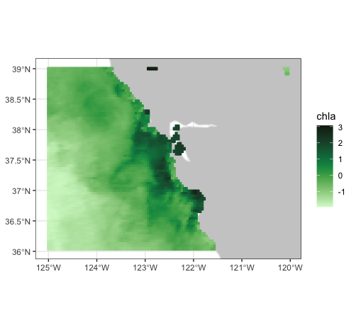

To convert the output to "tidy" long-form:

```{r viirs_tidy, echo = TRUE,  eval = FALSE}
VIIRS_tidy <- tidy_grid(VIIRS)
```

produces the structure:

```{r viirs_tidy_str, echo = TRUE,  eval = FALSE}
'data.frame':	8833 obs. of  4 variables:
 $ time     : POSIXlt, format: "2017-04-15" "2017-04-15" ...
 $ latitude : num [1:8833(1d)] 36 36.1 36.1 36.1 36.2 ...
 $ longitude: num [1:8833(1d)] -125 -125 -125 -125 -125 ...
 $ chla     : num  0.194 0.193 0.186 0.18 0.163 ...

```

### Crossing the date-line

The following is an `rxtracto_3D()` request that again uses the MUR dataset and crosses the date-line:

```{r dateline_3D, echo = TRUE,  eval = FALSE}
dataInfo <- rerddap::info('jplMURSST41mday')
parameter <- 'sst'
xcoord <- c(175, 185)
ycoord <- c(40, 50)
tcoord <- c('2019-03-16', '2019-03-16')
mur_dateline <- rxtracto_3D(dataInfo, parameter, xcoord = xcoord, ycoord = ycoord,
                       tcoord = tcoord)
```

## Plotting crossing the dateline

Plots that cross the date-line need to use the 'world2' continental outlines rather than the default. Due to some problems with that dataset, some regions must be removed in order to not get artificial lines.

```{r world2hires, echo = TRUE, eval = FALSE}
xlim <- c(170, 190)
ylim <- c(40, 55)
remove <- c("UK:Great Britain", "France", "Spain", "Algeria", "Mali", "Burkina Faso", "Ghana", "Togo")
w <- map("world2Hires", xlim = xlim, ylim = ylim, fill = TRUE, plot = FALSE)
w <- map("mapdata::world2Hires", regions = w$names[!(w$names %in% remove)], plot = FALSE, fill = TRUE, ylim = ylim, xlim = xlim)

```

`plotBBox()` can plot across the date-line, but the x-axis labels can be incorrect. The data can be plotted using `ggplot2`. A function `mapFrame()` is defined to help melt the data into a dataframe suitable for `ggplot2`, and then plotted using the outline defined above.

```{r world2hires_map, echo = TRUE, eval = FALSE}
mapFrame <- function(longitude, latitude, my_data) {
  my_data_name <- names(my_data)
  temp_data <- drop(my_data[[1]])
  dims <- dim(temp_data)
  temp_data <- array(temp_data, dims[1] * dims[2])
  my_frame <- expand.grid(x = longitude, y = latitude)
  my_frame[my_data_name] <- temp_data
  return(my_frame)
}
mur_frame <- mapFrame(mur_dateline$longitude, mur_dateline$latitude, mur_dateline['sst'])
mycolor <- cmocean::cmocean('thermal')(256)
  myplot <- ggplot(data = mur_frame, aes(x = x, y = y, fill = sst)) +
  geom_polygon(data = w, aes(x = long, y = lat, group = group), fill = "grey80") +     geom_tile(interpolate = FALSE) +
    scale_fill_gradientn(colours = mycolor, na.value = NA) + 
    theme_bw() + ylab("latitude") + xlab("longitude") +
    coord_fixed(1.3, xlim = xlim, ylim = ylim)
myplot
```

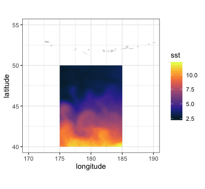

## Using `rxtractogon`

The function `rxtractogon()` extracts a time-series of satellite data that are within a user supplied polygon. Two examples are given. The first extracts chlorophyll within the boundary points of the Monterey Bay National Marine Sanctuary, available in the `mbnms` dataset which is loaded with the `rerddapXtracto` package.

```{r mbnmsChla, echo = TRUE, eval = FALSE}
require("rerddapXtracto")
dataInfo <- rerddap::info('erdVH3chlamday')
parameter = 'chla'
tpos <- c("2014-09-01", "2014-10-01")
#tpos <-as.Date(tpos)
xpos <- mbnms$Longitude
ypos <- mbnms$Latitude
sanctchl <- rxtractogon(dataInfo, parameter = parameter, xcoord = xpos, ycoord = ypos,  tcoord = tpos)
str(sanctchl)
```

The returned structure is:

```{r mbnmsChla_struct, echo = TRUE, eval = FALSE}
List of 6
 $ chla       : num [1:50, 1:57, 1:2] NA NA NA NA NA NA NA NA NA NA ...
 $ datasetname: chr "erdVH3chlamday"
 $ longitude  : num [1:50(1d)] -123 -123 -123 -123 -123 ...
 $ latitude   : num [1:57(1d)] 35.6 35.6 35.6 35.7 35.7 ...
 $ altitude   : logi NA
 $ time       : POSIXlt[1:2], format: "2014-09-15" "2014-10-15"
 - attr(*, "class")= chr [1:2] "list" "rxtracto3D"

```

The extract (see `str(sanctchl)`) contains two time periods of [chlorophyll]{style="color:blue"} masked for data only in the sanctuary boundaries. This example shows how to pull out only a single time period to be used in `plotBBox()`.

```{r mbnmsChlaPlot, echo = TRUE,  eval = FALSE}
require("ggplot2")
require("plotdap")
myFunc <- function(x) log(x)
sanctchl1 <- sanctchl
sanctchl1$chla <- sanctchl1$chla[, , 2]
sanctchl1$time <- sanctchl1$time[2]
sanctchlPlot <- plotBBox(sanctchl1, plotColor = 'algae', myFunc = myFunc)
sanctchlPlot
```

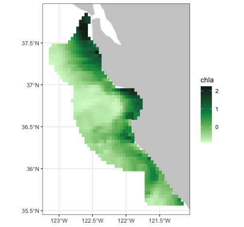

The map of the extract can also be animated through time:

```{r animate, eval = FALSE}
require("gganimate")
#> Loading required package: gganimate
require("ggplot2")
require("plotdap")
myFunc <- function(x) log(x)
sanctchlPlot <- plotBBox(sanctchl, plotColor = 'algae', myFunc = myFunc, time = identity, animate = TRUE)
```

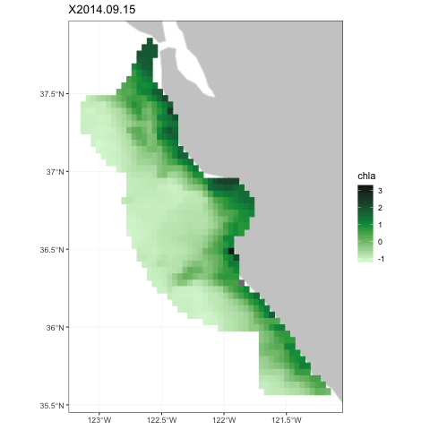

The MBNMS is famous for containing the Monterey Canyon, which reaches depths of up to 3,600 m (11,800 ft) below surface level at its deepest. `rxtractogon()` can extract the bathymetry data for the MBNMS from the [ETOPO]{style="color:red"} dataset:

```{r mbnmsBathy, echo = TRUE,  eval = FALSE}
require("rerddap")
dataInfo <- rerddap::info('etopo180')
xpos <- mbnms$Longitude
ypos <- mbnms$Latitude
bathy <- rxtractogon(dataInfo, parameter = 'altitude', xcoord = xpos, ycoord = ypos)
str(bathy)
```

The returned structure is:

```{r mbnmsBathy_struct, echo = TRUE,  eval = FALSE}
List of 6
 $ depth      : num [1:123, 1:141, 1] NA NA NA NA NA NA NA NA NA NA ...
 $ datasetname: chr "etopo180"
 $ longitude  : num [1:123(1d)] -123 -123 -123 -123 -123 ...
 $ latitude   : num [1:141(1d)] 35.5 35.6 35.6 35.6 35.6 ...
 $ altitude   : logi NA
 $ time       : logi NA
 - attr(*, "class")= chr [1:2] "list" "rxtracto3D"

```

Mapping the data to show the canyon:

```{r mbnmsBathyPlot, echo = TRUE, eval = FALSE}
require("ggplot2")
require("mapdata")
myFunc = function(x) -x
bathyPlot <- suppressMessages((plotBBox(bathy, plotColor = 'dense', myFunc = myFunc, name = 'Depth')))
bathyPlot
```

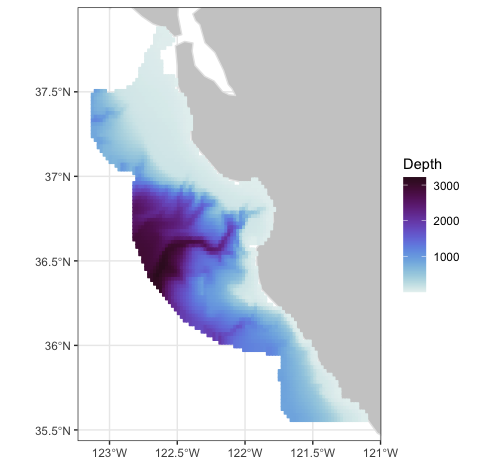

## Temperature at 70m in the north Pacific from the SODA model output

This is an example of an extract from a 4-D dataset (results from the "Simple Ocean Data Assimilation (SODA)" model), and illustrates the case where the z-coordinate does not have the default name "altitude". Water temperature at 70m depth is extracted for the North Pacific Ocean east of the dateline.

```{r soda70, echo = TRUE,  eval = FALSE}
require("rerddap")
dataInfo <- rerddap::info('erdSoda331oceanmday')
xpos <- c(185.25, 240.25)
ypos <- c(20.25, 60.25)
zpos <- c(76.80285, 76.80285)
tpos <- c('2010-12-15', '2010-12-15')
soda70 <- rxtracto_3D(dataInfo, parameter = 'temp', xcoord = xpos, ycoord = ypos, tcoord = tpos, zcoord = zpos, zName = 'depth')
```

```{r soda70Plot, echo = TRUE, eval = FALSE}
require("ggplot2")
require("plotdap")
sodaPlot <- plotBBox(soda70, plotColor = 'thermal', name = 'temp_at_70m', maxpixels = 30000)
sodaPlot

```

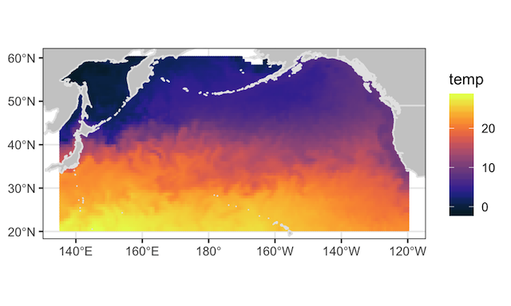

## Using a different ERDDAP™ server

### Irish Marine Institute {#hourly}

The Irish Marine Institute has an [ERDDAP™]{style="color:red"} server at <https://erddap.marine.ie/erddap/>. Among other datasets, there is hourly output from a model of the North Atlantic ocean, with a variety of ocean related parameters, see <https://erddap.marine.ie/erddap/griddap/IMI_NEATL.html>. To obtain sea surface salinity at latest time available for the domain of the model:

```{r NAtlSSS, eval = FALSE, echo = TRUE}
require("rerddap")
urlBase <- "https://erddap.marine.ie/erddap/"
parameter <- "sea_surface_salinity"
sssTimes <- c("last", "last")
sssLats <- c(48.00625, 57.50625)
sssLons <- c(-17.99375, -1.00625)
dataInfo <- rerddap::info("IMI_NEATL", url = urlBase)
NAtlSSS <- rxtracto_3D(dataInfo, parameter = parameter, xcoord = sssLons, ycoord = sssLats, tcoord = sssTimes)

```

```{r NAtlSSSplot, eval = FALSE, echo = TRUE}
require("ggplot2")
require("plotdap")
NAtlSSSPlot <- plotBBox(NAtlSSS, plotColor = 'haline', name = "salinity", maxpixels = 30000)
NAtlSSSPlot
```

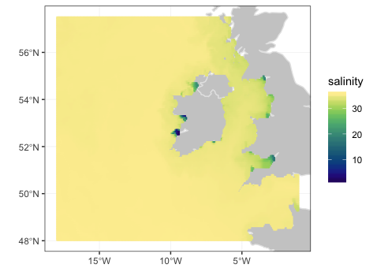

A lot of the details in the ocean are hidden in the plot above, because there are some low salinity values right close to shore. The plot can be modified using the `plotdap` function `add_ggplot()` so that only values between (32, 36) are plotted, and to change the colorbar to reflect this.

```{r NAtlSSSplot1, eval = FALSE, echo = TRUE}
require("ggplot2")
require("plotdap")
haline = cmocean::cmocean('haline')(256)
add_ggplot(NAtlSSSPlot, scale_colour_gradientn(colours = haline, na.value = NA, limits = c(32, 36)), scale_fill_gradientn(colours = haline, na.value = NA, limits = c(32, 36)))
```

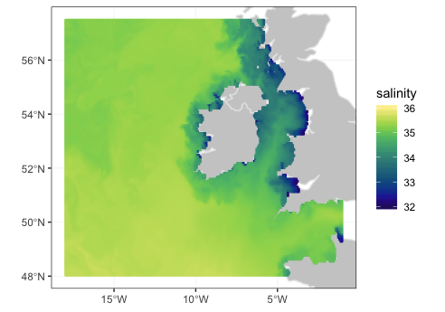
## Interactive plots

The `plotdap` plotting package has a new version of the function "box_set()" which can both reset the limits of the plot as well as return a `ggplot2` object that works with the `plotly` function "ggplotly()" to produce an interactive plot. The functions `plotTrack()` and `plotBBox()`  use `plotdap` to plots so this can be used with the results of these functions.

"box_set()" has the form:

```{r, echo = TRUE, eval = FALSE}

bbox_set <- function(plotobj, landmask = TRUE, xlim = NULL, ylim = NULL, interactive = FALSE)

```

If the values for "xlim" and "ylim" are not given,  then the function will determine the limits and projection of the `plotdap` object,  and set this in the `ggplot2` part of the the `plotdap` object.  If "interactive" is set to "TRUE",  then a `ggplot2` object is returned that works properly with the function `plotly::ggplotly()`.

Using "chlalogPlot" one of the VIIRS chlorophyll examples from above 

```{r, echo = TRUE, eval = FALSE}

new_plot <- plotdap::bbox_set(chlalogPlot, interactive = TRUE)
plotly::ggplotly(new_plot, tooltip = "text")

```

The resulting plot is an interactive plot that as you mouse over the data will display the latitude,  longitude and value at the point.  As the plot takes a long time to create and is quote large,  both of which cause problems with CRAN, it is not displayed here.


## What happens when you request an extract

When you make an `rerddapXtracto` request, particularly for track data using the function `rxtracto()` , it is important to understand what is extracted, because the remote dataset requested likely will have a different temporal and spatial resolution then the local dataset.

Specifically, let `longitude`, `latitude` and `time` be the coordinate system of the remote [ERDDAP™]{style="color:red"} dataset, and let `xpos`, `ypos` and `tpos` be the bounds of a request. Then the [ERDDAP™]{style="color:red"} request is based on the nearest grid point of the [ERDDAP™]{style="color:red"} dataset:

```{r nearGrid, eval = FALSE}
latitude[which.min(abs(latitude - ypos[1]))]  # minimum latitude
latitude[which.min(abs(latitude - ypos[2]))]  # maximum latitude
longitude[which.min(abs(longitude- xpos[1]))] # minimum longitude
longitude[which.min(abs(longitude - xpos[2]))] # maximum longitude
isotime[which.min(abs(time - tpos[1]))] # minimum time
isotime[which.min(abs(time - tpos[2]))] # maximum time
```

where `tpos` and `time` have been converted to an [R]{style="color:red"} date format so that it is a number rather than a string. For example, the FNMOC 6-hourly Ekman transports are on a 1-degree grid. A request for the data at a longitude of 220.2 and a latitude of 38.7 will return the result at a longitude of 220 and a latitude of 39. These values are then used in a call to `rerddap::griddap()`, with `parameter` being the variable of interest.

## Caching

`rerddap` caches requests as it's default behavior. For the function `rxtracto()`, as a lot of files are downloaded, these are removed from the cache after each download. For the functions `rxtracto_3D()` and `rxtratogon()` after downloading and putting the data into a dataframe, the downloaded netCDF file is copied from the cache to the present working directory, and renamed based on the parameter name, and the cached file is removed.
